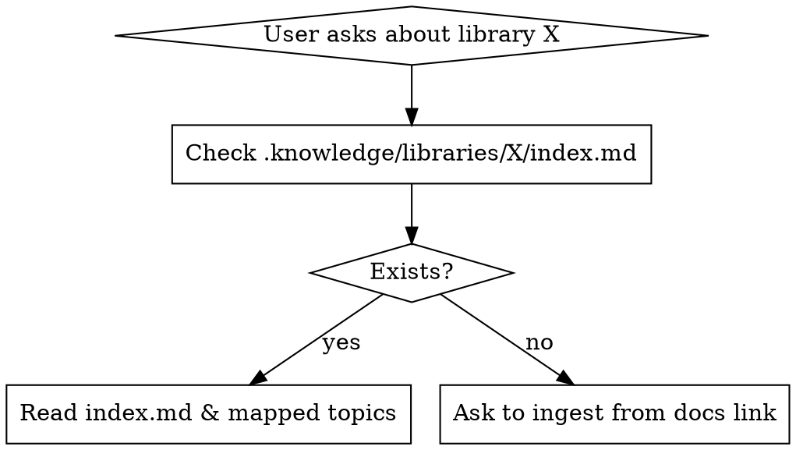

# Library Knowledge Manager

## Overview
This skill implements a local Retrieval-Augmented Generation (RAG) pattern. It prevents context window overflow and hallucinations by extracting, organizing, and querying library documentation locally within the project directory.

## When to Use



*   **Symptoms & Triggers:**
    *   User asks "How do I implement X using library Y?"
    *   User shares a documentation URL and says "Learn this."
    *   You are about to write code using a library you don't confidently know.
    *   You feel the need to use `webfetch` to read library documentation during a coding task.
*   **When NOT to use:**
    *   Standard library features that are natively known and unchanging.
    *   General programming concepts unrelated to a specific package.

## Architecture

Data is stored in `.knowledge/libraries/<library_name>/`:
*   `index.md`: The central map. Contains a brief library overview, setup instructions, and a **table of contents mapping topics to files**.
*   `<topic_name>.md`: Specific knowledge files (e.g., `routing.md`, `state_providers.md`).
*   `_urls.txt`: Log of processed URLs to avoid duplicate scraping.

## Core Workflows

### 1. Retrieval (Querying)
1. Read `.knowledge/libraries/<library_name>/index.md`.
2. Identify which `<topic_name>.md` file(s) contain the answer.
3. Read ONLY those specific topic files.
4. Generate the code/answer.

### 2. Ingestion (Scraping & Synthesizing)
When asked to learn a library from a URL:
1. `webfetch` the start URL. Extract all relevant documentation links and save to `_urls.txt`. (If it's an SPA and links are hidden, ask the user for a list).
2. Iterate through `_urls.txt`. For each page:
   * **Identify the Topic:** Determine the core subject (e.g., "Error Handling").
   * **Synthesize Content (CRITICAL RULES):**
     * **KEEP:** Class/function signatures, parameter descriptions, return types, code examples, caveats, best practices, edge cases.
     * **DISCARD:** Navigation menus, headers/footers, table of contents, SEO fluff, marketing text, author credits.
     * **DO NOT OVER-SUMMARIZE:** If an API has 5 parameters, keep all 5 with their descriptions. Code needs precision, not a vague summary.
   * **Route:** Check `index.md`. If the topic exists, append the new synthesis to the existing `<topic>.md`. If not, create it.
3. Update `index.md` with the new file mapping.

### 3. Maintenance
When user provides updates or notes:
1. Find the relevant topic via `index.md`.
2. Edit `<topic_name>.md` to include team best practices, deprecation notices, or custom snippets.

## Red Flags - STOP and Start Over

*   **"I'll just webfetch the docs on the fly while writing the code."** (Red Flag: Wastes tokens, loses context. Do proper ingestion first).
*   **"I will summarize this page into one paragraph."** (Red Flag: Deleting API signatures and parameters. You must KEEP code and parameters).
*   **"I'll put all the documentation into one big `library.md` file."** (Red Flag: Will cause context overflow. Split by topics).
*   **"I don't need to update `index.md`."** (Red Flag: Makes the topic invisible to future queries).

## Common Mistakes & Rationalizations

| Excuse | Reality |
|--------|---------|
| "The library is small, I'll put it in one file." | Small libraries grow. Strict topic separation prevents future context limits. |
| "I'll summarize the parameters to save space." | If you summarize `timeout: int` as "has timeout", you won't know if it's seconds or milliseconds later. Keep exact signatures. |
| "I don't need to read `index.md`, I'll just glob the folder." | `index.md` provides context and relationships that raw files lack. Always read the index. |

## Quick Reference: Synthesis Example

**BAD Extraction (Too summarized):**
> The `Dio` class is used for networking. It has a `get` method for GET requests. You can pass options.

**GOOD Extraction (Precise):**
> ### `Dio` Basics
> Used for HTTP requests.
> ```dart
> final dio = Dio();
> Future<Response> get(String path, {Object? data, Map<String, dynamic>? queryParameters, Options? options, CancelToken? cancelToken, ProgressCallback? onReceiveProgress});
> ```
> **Key Parameters:**
> * `path`: Request URL.
> * `queryParameters`: Map of URL query params.
> * `options`: Use `Options(headers: {...})` for custom headers.
> **Caveats:** Throws `DioException` on non-200 status codes.
